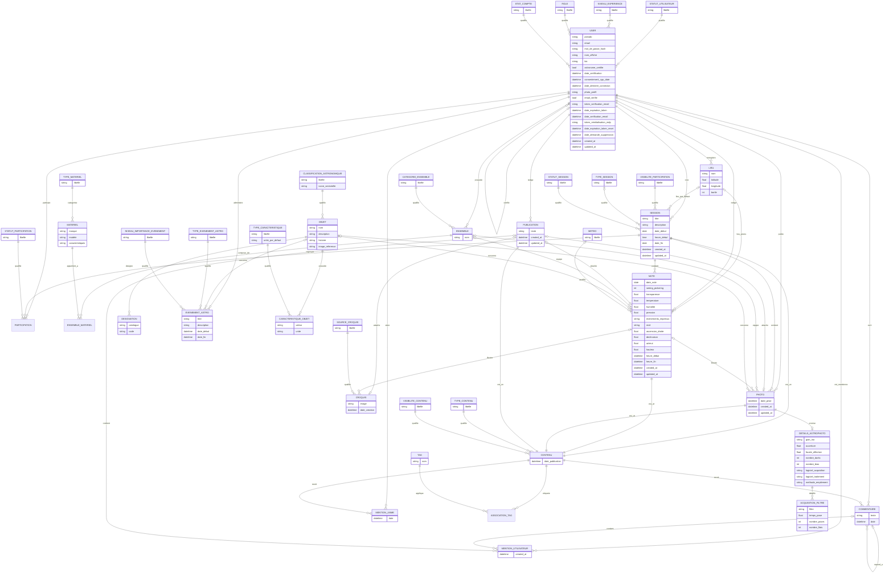

# Modèle de données // AstroSeen

## Contexte de cette révision

La v1 du modèle visait un public homogène (amateurs partageant des sorties). Le public cible s'élargit désormais à quatre profils qui cohabitent sur la même plateforme : passionnés, astrophotographes, experts et professionnels (chercheurs, personnel d'observatoire, etc.).

Deux axes orthogonaux distinguent ces profils, et il ne faut pas les confondre dans le modèle :
- **le rapport à l'astronomie** (loisir ou métier) — n'implique aucun droit particulier dans l'app ;
- **les permissions dans l'application** (membre, modérateur, admin, astronome certifié) — indépendantes du niveau d'expertise déclaré.

La v1 n'ayant jamais été mise en production, cette révision corrige aussi directement quelques incohérences structurelles relevées lors de la relecture, sans contrainte de migration.

## Modifications sur les entités existantes

### Utilisateur -> étendu
- `pseudo`
- `email` — **absent par erreur des versions précédentes du modèle**, alors que c'est le champ d'identification de base pour l'authentification JWT
- `mot_de_passe_hash` (jamais stocké en clair — hachage bcrypt ou argon2)
- `nom_affiche` (optionnel — nom réel, utile pour les pros qui veulent être identifiables)
- `bio` (optionnel)
- rattaché à un `Statut utilisateur` (table de référence — voir ci-dessous)
- rattaché à un `Niveau d'expérience` (table de référence — voir ci-dessous)
- rattaché à un `Role` (table de référence — voir ci-dessous)
- `astronome_certifie` (bool) — badge de distinction accordé par un administrateur, sans droit particulier associé (ni validation de contenu, ni permission supplémentaire) : il sert uniquement à distinguer visiblement ces profils des autres utilisateurs.
- `certifie_par` (optionnel — référence vers l'utilisateur admin ayant accordé le statut)
- `date_certification` (optionnel)
- `consentement_cgu_date` — date d'acceptation des CGU et de la politique de confidentialité, requise pour la conformité RGPD (preuve de consentement)
- `date_derniere_connexion` — utile pour appliquer une politique de conservation/suppression des comptes inactifs (voir section RGPD du cahier des charges)
- rattaché à un `Etat compte` (table de référence — voir ci-dessous)
- `photo_profil` (optionnel) — URL/chemin de l'image de profil
- `email_verifie` (bool, défaut faux) — le compte doit être vérifié par email à la création, avant d'être pleinement actif
- `token_verification_email` (optionnel) — jeton envoyé par email, à usage unique
- `date_expiration_token` (optionnel) — le lien de vérification n'est valable que temporairement
- `date_verification_email` (optionnel) — renseigné une fois la vérification effectuée
- `token_reinitialisation_mdp` (optionnel) — jeton distinct de celui de vérification email, envoyé pour réinitialiser le mot de passe. Séparé volontairement : partager le même jeton entre les deux flux invaliderait l'un en résolvant l'autre.
- `date_expiration_token_reset` (optionnel) — le lien de réinitialisation n'est valable que temporairement, comme celui de vérification
- `date_demande_suppression` (optionnel) — renseignée quand l'utilisateur demande la suppression de son compte (droit à l'effacement RGPD), tant que `etat_compte` reste encore `actif`. Un admin doit traiter la demande pour que `etat_compte` bascule à `supprimé` — sans ce champ, impossible de constituer une file d'attente des demandes en cours.

### Toutes les classifications sont des tables de référence, pas des enums
Décision transversale : **aucun type énuméré** (enum PostgreSQL/Prisma) dans tout le modèle — chaque classification (statut, type, visibilité, catégorie...) est une table de référence à part entière, avec un simple `id` + `libelle`. Plus simple à manipuler côté code (une jointure uniforme plutôt que deux façons différentes de gérer une valeur fixe), et une nouvelle valeur s'ajoute par une insertion de ligne, sans migration de schéma.

17 tables de référence au total :

| Table | Rattachée à | Valeurs de départ | Éditable via le panel admin |
|---|---|---|---|
| Statut utilisateur | User | Amateur, Professionnel | Oui |
| Niveau d'expérience | User | Débutant, Confirmé, Expert | Oui |
| Role | User | Membre, Modérateur, Administrateur | **Non** — pilote les permissions codées en dur |
| Etat compte | User | Actif, Banni, Supprimé | Oui |
| Visibilité participation | Session | Publique, Privée, Sur invitation | Oui |
| Type session | Session (optionnel) | Loisir, Campagne, Formation | **Non** |
| Statut session | Session | Planifiée, En cours, Terminée, Annulée | **Non** — pilote probablement une machine à états côté backend |
| Statut participation | Participation | Invitée, Confirmée, Refusée | Oui |
| Catégorie ensemble | Ensemble | Classique, Astrophoto | Oui |
| Type matériel | Matériel | Télescope, Monture, Caméra, Oculaire, Filtre, Réducteur de focale, Barlow, Autoguideur, Trépied, Autre | Oui |
| Classification astronomique | Objet | Étoile, Étoile variable, Planète, Planète naine, Comète, Astéroïde, Galaxie, Nébuleuse, Amas ouvert, Amas globulaire, Étoile à neutrons, Supernova, Reste de supernova, Satellite, Autre | Oui |
| Type caractéristique | Caractéristique objet | Magnitude apparente, Distance, Taille apparente, Constellation, Type spectral, Type morphologique, Période orbitale, Redshift, Vitesse radiale, Masse, Rayon, Température de surface, Ascension droite (catalogue), Déclinaison (catalogue), Autre | Oui |
| Source croquis | Croquis | Importé, Dessiné | Oui |
| Type contenu | Contenu | Session, Note, Photo, Publication | Oui |
| Visibilité contenu | Contenu | Privée, Publique | Oui |
| Type événement astro | Événement astronomique | Éclipse, Pluie de météores, Opposition, Conjonction, Transit, Occultation, Autre | Oui |
| Niveau importance événement | Événement astronomique | Majeur, Mineur | Oui |
| Météo | Note | Dégagé, Partiellement nuageux, Nuageux, Couvert, Brumeux, Pluie, Vent fort, Orageux, Autre | **Non** |

**Tables verrouillées (non éditables via le panel admin)** : `Role`, `Type session`, `Statut session`, `Météo`. Ces tables sont référencées par de la logique applicative codée en dur (vérifications de permission, machine à états, taxonomie fixe) — les modifier via une UI générique risquerait de désynchroniser le code et les données plutôt que d'apporter une vraie flexibilité. Toute évolution de ces tables passe par le code + une migration, pas par le panel admin.

### Compte banni ou supprimé -> anonymisation plutôt que suppression en cascade
Résout le point resté ouvert en section 9.3 du cahier des charges. Plutôt que de supprimer ou réassigner les notes/photos/sessions/commentaires d'un utilisateur banni ou supprimé (ce qui casserait l'historique des autres participants et forcerait à toucher sept tables différentes qui référencent `Utilisateur`), le contenu **reste lié à la même ligne `Utilisateur`** — c'est l'état de ce compte qui change, et l'affichage « Utilisateur anonyme » est dérivé de cet état à la lecture, pas stocké nulle part ailleurs.

- `Etat compte` : *actif* / *banni* / *supprimé*
  - **banni** : pseudo et nom affichés publiquement comme « Utilisateur anonyme », connexion bloquée, mais les données réelles (email, pseudo d'origine...) restent en base pour la traçabilité de modération.
  - **supprimé** : en plus de l'affichage anonyme, les champs personnels (`email`, `mot_de_passe_hash`, `nom_affiche`, `bio`, `pseudo`) sont réellement écrasés — c'est la mise en œuvre concrète du droit à l'effacement RGPD, sans casser l'intégrité référentielle du contenu déjà publié.

**Vérification email — point à trancher côté implémentation** : le compte doit-il être totalement bloqué (impossible de se connecter) tant que `email_verifie = faux`, ou seulement limité dans certaines actions (ex. pas de publication publique avant vérification) ? Pas une question de modèle de données — les deux options utilisent les mêmes champs — mais à décider avant de coder le flux d'inscription/connexion (`AST-19`/`AST-20`).

Aucune modification nécessaire sur `Session`, `Note`, `Photo`, `Commentaire`, `Lieu`, `Ensemble`, `Participation`, `Mention j'aime` ou `Événement astronomique` : leurs relations vers `User` ne changent pas, seul l'état de la ligne référencée change.

### Session -> étendu
- `description` (texte libre, optionnel) — précise le contexte/l'objectif de la sortie, ex. « Observation entre amis des étoiles du ciel profond à la recherche d'une étoile binaire »
- `date_debut` (date, obligatoire) — le jour de début est toujours connu
- `heure_debut` (heure, optionnelle) — précisée séparément si l'heure de rendez-vous entre participants est déjà fixée, sinon laissée vide tant qu'elle n'est pas connue
- `date_fin` (date seule, sans heure) — ne marque qu'une borne approximative de fin de sortie, qui peut s'étaler sur plusieurs nuits ; l'heure précise d'observation vit sur les Notes individuelles (`heure_debut`/`heure_fin`), pas ici
- rattachée à une `Visibilité participation` (table de référence : publique/privée/sur invitation) — qui peut rejoindre ou voir l'existence de la session (à ne pas confondre avec la publication du contenu résultant, voir plus bas)
- rattachée en optionnel à un `Type session` (table de référence : loisir/campagne/formation)

### Lieu -> étendu
- `bortle` (int, 1 à 9) — échelle de pollution lumineuse du site. Portée volontairement sur `Lieu` plutôt que sur `Note` : c'est une caractéristique du site (généralement stable, documentée par les cartes de pollution lumineuse), pas une condition ponctuelle de la nuit — contrairement au seeing ou à la transparence. Comme une Note peut déjà surcharger le lieu par défaut de la Session, le Bortle suit automatiquement sans champ supplémentaire à dupliquer.

**Lieux communs entre utilisateurs** : bien que le catalogue `Lieu` reste personnel à chaque utilisateur (un `Lieu` appartient à un seul propriétaire), une fonctionnalité affiche « X autres personnes observent depuis cet endroit » en comparant les coordonnées d'un lieu à celles des lieux d'autres utilisateurs, arrondies à 3 décimales (~110 m, échelle d'un site/parking) pour regrouper des saisies proches mais jamais identiques au chiffre près. Aucune nouvelle table : c'est une requête agrégée à la volée, appuyée par un index d'expression sur les coordonnées arrondies (voir `mpd_astroseen.sql`). Seul le nombre de personnes est affiché, jamais leur identité — pas de fuite d'information au-delà d'un compte anonyme.

### Type de matériel (nouvelle table de référence)
Le champ `type` de `Matériel` recouvre des choses trop diverses (télescope, monture, caméra, oculaire, filtre, réducteur de focale, Barlow, autoguideur, trépied...) pour rester un simple champ texte libre — même risque de doublons/variantes orthographiques que pour statut/niveau/rôle. Il devient une table de référence :

**Type_Materiel** (nouvelle)
- `libelle` — valeurs de départ : *Télescope*, *Monture*, *Caméra*, *Oculaire*, *Filtre*, *Réducteur de focale*, *Barlow*, *Autoguideur*, *Trépied*, *Autre*

### Ensemble / Matériel -> relation N-N, catalogue partagé et suppression conditionnelle
Un même appareil physique (une caméra, un oculaire, une monture...) peut appartenir à **plusieurs** `Ensemble` — par exemple une caméra utilisée à la fois dans un setup « visuel club » et un setup « astrophoto Ha/OIII/SII ». La relation `Ensemble`–`Matériel` passe donc de 1-N à **N-N**, via une table de jointure :

**Ensemble_Materiel** (nouvelle, jointure N-N)
- rattache un `Ensemble` à un `Matériel`
- contrainte d'unicité (ensemble, matériel) : pas de doublon d'association

`Matériel` devient un **catalogue partagé entre tous les utilisateurs**, plutôt qu'une fiche dupliquée à chaque saisie :
- **Dédoublonnage** : contrainte d'unicité sur (`type`, `marque`, `modèle`) — le `type` étant désormais une référence vers `Type_Materiel` plutôt qu'un texte libre — si un modèle de télescope existe déjà en base, une nouvelle personne qui l'ajoute est reliée à la fiche existante plutôt que d'en créer une copie. Ça implique une recherche/autocomplétion côté saisie (« ce modèle existe déjà, voulez-vous le réutiliser ? ») plutôt qu'un simple formulaire libre. Un matériel sans marque/modèle renseigné (générique, sans info suffisante pour matcher) reste dédupliqué au cas par cas, sans forcer de fusion hasardeuse.
- **Suppression conditionnelle** : retirer un matériel de sa propre liste ne fait que supprimer le lien `Ensemble_Materiel` correspondant — la fiche `Matériel` elle-même n'est supprimée de la base que si **plus aucun** `Ensemble_Materiel` ne la référence. Cette règle est implémentée par un trigger côté base (voir `mpd_astroseen.sql`), pas seulement côté application, pour garantir qu'elle s'applique quel que soit le chemin de suppression emprunté.

### Note -> conditions structurées et correction de cardinalité
- `date_note` (date, obligatoire) — la nuit précise à laquelle porte cette note. Pré-remplie automatiquement depuis `Session.date_debut` à la création, mais modifiable : une session peut s'étaler sur plusieurs nuits, une note doit pouvoir préciser sur laquelle elle porte, indépendamment de l'heure exacte (`heure_debut`/`heure_fin`, toujours optionnelles ci-dessous).
- `seeing_pickering` (int, 1 à 10) — **seule échelle stockée en base**, la plus précise des deux. L'échelle d'Antoniadi (I à V, avec le libellé qualité *Parfaite / Très bonne / Moyenne / Mauvaise / Très mauvaise*) est dérivée à l'affichage par une table de correspondance fixe côté application (pas une table en base, puisque c'est une conversion figée, pas une donnée) :

  | Pickering | Antoniadi | Qualité |
    |---|---|---|
  | 9-10 | I | Parfaite |
  | 7-8 | II | Très bonne |
  | 5-6 | III | Moyenne |
  | 3-4 | IV | Mauvaise |
  | 1-2 | V | Très mauvaise |

- `transparence` (magnitude limite à l'œil nu, NELM)
- `temperature`, `humidite`, `pression` (tous optionnels)
- rattachée en optionnel à une `Météo` (table de référence, remplace l'ancien `conditions_libre`) — un menu de sélection plutôt qu'un texte libre, valeurs de départ : *Dégagé*, *Partiellement nuageux*, *Nuageux*, *Couvert*, *Brumeux*, *Pluie*, *Vent fort*, *Orageux*, *Autre*
- `evenements_imprevus` (texte libre, optionnel) — pour tout ce qui ne rentre dans aucune case et n'est pas une caractéristique récurrente du lieu (déjà couverte par `Lieu.bortle`) : un incident ponctuel et local propre à cette session (ex. lampadaire allumé par erreur, phares de voiture traversant le champ de vision, animal dérangeant l'observation)
- `recit` (texte riche, optionnel) — un espace de rédaction longue, façon Notion (titres, listes, mise en forme), une fois les conditions et caractéristiques renseignées. Distinct des champs structurés ci-dessus : ceux-là sont des données mesurables, `recit` est le récit libre de la soirée que l'observateur veut garder. Stocké en Markdown côté base — **spec complète, non bridée** : titres H1 à H6, tableaux, liens, images, citations, blocs de code, listes à puces/numérotées/cases à cocher, séparateurs. Pas de sous-ensemble limité choisi arbitrairement — tout ce que le format Markdown permet nativement reste disponible. Côté frontend, l'éditeur suit le pattern Notion : quelques raccourcis rapides (gras, italique) toujours visibles, et une commande "/" qui ouvre le menu complet des types de blocs plutôt qu'une barre d'outils qui esaierait de tout lister.
- La notion de "brouillon" n'est plus une table séparée (`Statut_publication_note` retirée) — elle correspond directement à `Contenu.visibilite = Privée`. Le statut « validée par pair » avait déjà disparu avec l'abandon du mécanisme de validation : l'astronome certifié reste un simple badge de distinction, sans droit de validation.
- `ascension_droite`, `declinaison` (float, degrés décimaux, tous deux optionnels) — position équatoriale de l'objet au moment de l'observation, pour les montures équatoriales
- `azimut`, `hauteur` (float, degrés décimaux, tous deux optionnels) — position horizontale de l'objet, pour les montures alt-azimutales
  - Une seule des deux paires est renseignée par note, selon le type de monture utilisé. Aucune colonne ne stocke explicitement "quel système a été utilisé" : cette détermination se fait côté frontend en fonction des champs remplis. Toutes les valeurs sont stockées en degrés décimaux (y compris l'ascension droite, habituellement affichée en h/m/s) pour rester directement exploitables en calcul/tri — la conversion en h/m/s ou d/m/s ne se fait qu'à l'affichage.
- **Correction** : la relation vers `Ensemble` passe d'obligatoire à optionnelle, pour permettre l'observation à l'œil nu sans obliger l'utilisateur à créer un faux ensemble matériel.

### Objet du ciel (ex-Cible), renommage, désignations multiples et caractéristiques structurées
Renommé de `Cible` à `Objet` — plus fidèle au vocabulaire courant (« objets du ciel profond ») ; `Cible` prêtait à confusion, l'idée de départ étant juste qu'il s'agit de l'objet visé par l'observation.
- rattaché à une `Classification astronomique` (table de référence, ex-`Type objet` — renommé pour plus de précision) — valeurs détaillées ci-dessous
  - `icone_vectorielle` (optionnel, sur la table de référence) — icône SVG générique de cette classification, affichée en secours quand le filtre « Images personnelles » d'un objet ne retourne aucune photo — évite de laisser croire à l'utilisateur qu'une image communautaire lui appartient

**Désignation** (liée à Objet en 1-N)
- `catalogue` (Messier, NGC, IC, désignation populaire...)
- `code`

**Décision (v1)** : le champ `cible` en texte libre qui existait sur `Note` en v1 disparaît. Tout objet est désormais forcément une entrée du catalogue `Objet` (avec une classification `autre` si besoin), relié en optionnel — ça élimine le doublon relevé en relecture et rend les statistiques par objet fiables dès le départ, y compris pour des objets non standards saisis à la volée.

**Caractéristiques structurées, pas un champ texte unique** : un objet du ciel porte beaucoup de données très variables selon son type (magnitude apparente, distance, taille apparente, type spectral, période orbitale, redshift...) — un seul champ `caracteristiques` en texte libre n'est pas suffisant. Plutôt qu'une liste de colonnes fixes (dont la plupart resteraient vides selon le type d'objet), c'est une table à part :

**Type caractéristique** (table de référence)
- `libelle` — valeurs de départ : *Magnitude apparente*, *Distance*, *Taille apparente*, *Constellation*, *Type spectral*, *Type morphologique*, *Période orbitale*, *Redshift*, *Vitesse radiale*, *Masse*, *Rayon*, *Température de surface*, *Ascension droite (catalogue)*, *Déclinaison (catalogue)*, *Autre*
- `unite_par_defaut` (optionnel) — ex. `mag`, `al`, `arcmin`

**Caractéristique objet** (liée à Objet en 1-N)
- rattachée à un `Type caractéristique`
- `valeur` (texte — reste flexible : nombre, texte catalogué, etc.)
- `unite` (optionnel — surcharge `unite_par_defaut` si besoin, ex. donner une distance en parsecs plutôt qu'en années-lumière)
- contrainte d'unicité (objet, type caractéristique) : pas deux fois la même caractéristique sur un même objet

Un objet peut ainsi porter autant de caractéristiques que pertinent pour son type, sans colonnes toujours vides pour les autres types.

**Cas particulier : position catalogue pour les objets fixes.** `Ascension droite (catalogue)` et `Déclinaison (catalogue)` ne concernent que les objets dont la position dans le ciel est quasi invariable (galaxies, nébuleuses, amas...), à la différence des `Note.ascension_droite`/`declinaison` qui capturent la position observée à un instant précis. Une planète comme Jupiter n'a jamais ces deux caractéristiques renseignées : sa position change de nuit en nuit, une valeur fixe serait fausse dès le lendemain.

### Détails astrophoto -> support multi-filtres
Une acquisition LRGB ou en bande étroite utilise plusieurs filtres avec des temps de pose, un nombre de poses et un nombre de flats différents pour chacun (contrairement aux darks/bias, indépendants du filtre). La v1 ne pouvait décrire qu'une acquisition mono-filtre. On sort ces champs dans une sous-table :

**Détails astrophoto** (allégée)
- `gain_iso`, `ouverture`, `focale_effective`
- `nombre_darks`, `nombre_bias`
- `logiciel_acquisition`, `logiciel_traitement`, `methode_empilement`

**Acquisition filtre** (nouvelle, 1-N sous Détails astrophoto)
- `filtre`
- `temps_pose`, `nombre_poses`, `nombre_flats`

### Croquis
Un croquis est soit une image importée par l'utilisateur, soit un dessin réalisé directement sur un canevas intégré à l'application puis enregistré comme image — dans les deux cas, la donnée stockée est la même (un fichier image), seule son origine diffère.
- `image` (fichier)
- rattaché à une `Source croquis` (table de référence : importé/dessiné)
- `date_creation`
- rattaché uniquement à une `Note` (contrairement à `Photo`, qui peut aussi être ajoutée directement à une session) — pas de champs `ensemble`/`objet`/`détails_astrophoto`, qui n'ont pas de sens pour un dessin d'observation

### Publication et interactions communautaires (nouvelle abstraction : Contenu)

Trois nouveaux besoins partagent tous la même mécanique : faire progresser une Session, une Note ou une Photo à travers trois niveaux de visibilité (brouillon privé → partagé avec les participants de la session → publié au fil d'actualité), et permettre à la communauté de commenter, aimer et étiqueter le contenu une fois publié, pour alimenter un fil d'actualité filtrable.

Plutôt que de dupliquer trois fois (Session, Note, Photo) les mêmes mécaniques de visibilité, de commentaires, de likes et de tags, on introduit une table technique commune :

**Contenu** (entité technique, pas une notion métier visible par l'utilisateur)
- rattaché à un `Type contenu` (table de référence : session/note/photo/publication) — dénormalisé sur Contenu, pour filtrer sans jointure supplémentaire
- rattaché à une `Visibilite contenu` (table de référence : **privée [défaut] / session / publique**) — remplace le champ `visibilite` qui était directement sur `Session`. *Session* est un niveau intermédiaire : concrètement utilisé par `Note` et `Photo` (visible par les participants de la session sans être encore diffusé au fil d'actualité) ; `Session` en tant que type de `Contenu` n'a pas d'usage réel pour cette valeur-là, ni `Publication` d'ailleurs (elle vise directement le fil) — pas une contrainte du schéma, une règle d'usage côté applicatif
- `date_publication` (optionnel, renseigné au moment du passage en `publique`)

`Session`, `Note`, `Photo` et désormais `Publication` sont chacune reliées en 1-1 à une ligne `Contenu`, créée automatiquement à leur création. `Commentaire`, la nouvelle `Mention j'aime` et le nouveau système de `Tag` se rattachent tous à `Contenu` plutôt qu'à chacune des tables séparément.

**Publication** (nouvelle entité — le bouton « + » du fil d'actualité) — un post libre, façon réseau social, distinct d'une Note ou d'une Photo : pas rattaché à une Session, pensé pour partager un texte court avec, en option, un contenu déjà existant en pièce jointe.
- `texte` (texte libre — ce qu'on écrit dans le post)
- rattaché en 1-1 à un `Contenu` (comme les 3 autres types)
- rattachée à un `User` auteur
- rattachée en optionnel à **une seule** des trois : `Photo`, `Note` ou `Croquis` — jamais plusieurs à la fois (contrainte applicative, pas un CHECK SQL, cohérent avec comment on a déjà géré les coordonnées mutuellement exclusives de `Note`)
- **Règle de propriété** : le contenu attaché doit appartenir à l'auteur de la Publication (`Photo.publie_par` / `Note.redige_par` / `Croquis → Note.redige_par` doit correspondre à l'auteur) — vérifiée côté application à la création, pas dans le schéma

**Règle de filtrage du fil d'actualité** : seuls les `Contenu` où `visibilite = publique` y apparaissent. Un contenu en `session` reste invisible au fil tant qu'il n'est pas explicitement publié — il n'est visible que par les participants de la session concernée (requête à filtrer côté application : `Contenu.visibilite = publique` pour le fil, vs. `visibilite IN (session, publique)` ET appartenance à la session pour la vue "notes de la session"). Une `Publication` n'a pas cette étape intermédiaire : elle est écrite puis directement publiée.

**Commentaire — portée élargie** : se rattache désormais à `Contenu` (donc à une session, une note, une photo ou une publication indifféremment) au lieu de `Session` uniquement comme en v1/v2 — cohérent avec le fil d'actualité qui affiche des items individuels commentables.
- **Réponses en fil** : `Commentaire` se rattache en optionnel à un autre `Commentaire` (`commentaire_parent`, auto-référence) — `NULL` pour un commentaire de premier niveau, renseigné pour une réponse. Volontairement limité à un seul niveau de profondeur côté application (une réponse à une réponse s'affiche au même niveau que sa réponse parente) pour éviter un fil illisible à l'infini — c'est une convention d'affichage, pas une contrainte du schéma, qui autorise techniquement une profondeur illimitée.

**Mention utilisateur** (nouvelle) — le `@pseudo` façon Discord, dans un commentaire ou une publication. Nommée `Mention_utilisateur` et non simplement `Mention`, pour ne pas se confondre avec `Mention_jaime` (les likes) qui existe déjà.
- rattachée à l'`User` mentionné
- rattachée en optionnel à **un seul** des deux : `Commentaire` ou `Publication` (jamais les deux, contrainte applicative comme pour `Publication` plus haut) — volontairement pas étendue à `Note.recit`, trop coûteux à re-parser dans un champ Markdown long pour un besoin pas exprimé
- déclenche une notification pour l'utilisateur mentionné (mécanisme de notification pas encore modélisé — à faire au moment de s'y atteler)

**Mention j'aime** (nouvelle)
- `date`
- rédigée par un `User`, ciblant un `Contenu`
- contrainte d'unicité (utilisateur, contenu) : un like par personne et par contenu
- **Ne s'applique pas à un `Contenu` de type `Note`** — une note n'est pas un post, le like n'a pas de sens dessus (règle applicative, pas une contrainte du schéma, cohérent avec les autres exceptions par type déjà documentées sur `Contenu`). Les commentaires restent actifs sur une Note : ils servent à signaler une difficulté rencontrée ou demander une précision, pas à socialiser.

**Tag** (nouveau)
- `nom`

**Association tag** (nouvelle, jointure N-N entre `Tag` et `Contenu`)

> **Distinction à garder en tête** : le `visibilite` de `Session` (publique/privée/sur invitation) contrôle qui peut **rejoindre ou voir l'existence** de la session ; le `visibilite` de `Contenu` contrôle qui peut voir **le résultat publié** dans le fil communautaire et le planétarium — les deux sont indépendants. Une session privée (sur invitation) peut très bien voir certaines de ses notes ou photos publiées après coup.

> **Compromis assumé** : cette table `Contenu` ajoute un niveau d'indirection (une jointure de plus pour accéder à une session/note/photo depuis un commentaire ou un like) en échange d'éviter de tripler la logique de commentaires/likes/tags. Si ça s'avère too much pour le calendrier du projet, la version "sans Contenu" reste possible : trois FK optionnelles (`session_id`/`note_id`/`photo_id`) sur `Commentaire`, `Mention j'aime` et `Association tag`, avec une contrainte "exactement une renseignée" — plus simple à comprendre au premier coup d'œil, mais moins propre à terme.

**Croquis** : pas de ligne `Contenu` propre — un croquis suit la visibilité de la `Note` à laquelle il est rattaché, il n'est jamais publié indépendamment.

### Objet — planétarium (catalogue consultable)
Pour servir de page « fiche objet » consultable librement (façon Pokédex), `Objet` porte :
- `nom` (nom usuel affiché, ex. *Lune*, *Nébuleuse d'Orion* — distinct des codes de catalogue portés par `Désignation`)
- `description` (texte — présentation générale, courte)
- `histoire` (texte — histoire/contexte scientifique de l'objet, ex. sa découverte, son intérêt d'observation)
- `image_reference` (optionnel) — image de couverture officielle/admin de la fiche objet, distincte des `Photo` communautaires (utile pour un objet difficile à photographier, ex. Cérès)
- ses caractéristiques structurées (voir section dédiée ci-dessus — `Caractéristique objet`)

La page « fiche objet » du planétarium affiche les `Photo` où `objet = cet objet` et `Contenu.visibilite = publique`, avec un filtre **Images personnelles / Images communautaires** qui ne fait que distinguer, à l'affichage, les photos dont l'auteur est l'utilisateur connecté de celles publiées par les autres — aucune structure supplémentaire n'est nécessaire, c'est une simple requête filtrée sur les relations déjà existantes (`Photo.publie_par` + `Contenu.visibilite`).

### Calendrier — événements astronomiques (nouvelle entité)
Le calendrier combine deux sources bien distinctes, à ne pas mélanger dans une seule table :
- les **sessions de l'utilisateur** (créées par lui, ou auxquelles il a une `Participation` acceptée) — déjà entièrement modélisées via `Session`/`Participation`, aucune nouvelle structure nécessaire, c'est une simple requête combinée à l'affichage ;
- les **événements astronomiques** (éclipses, pluies de météores, oppositions planétaires...), qui n'existent pas encore et sont gérés par un administrateur plutôt que par les utilisateurs.

**Événement astronomique** (nouvelle entité)
- `titre`
- `description`
- `date_debut`, `date_fin` (optionnel — nul pour un événement ponctuel comme une éclipse, renseigné pour une période comme un pic de pluie de météores)
- rattaché à un `Type événement astro` (table de référence : éclipse, pluie de météores, opposition planétaire, conjonction, transit, occultation, autre) — comme `Classification_astronomique`, cette table de référence porte un champ `icone_vectorielle` (optionnel) : une icône propre à chaque type, pour l'identifier visuellement au premier coup d'œil (calendrier, panel admin, fiche événement) sans devoir lire le libellé
- rattaché à un `Niveau importance événement` (table de référence : majeur/mineur), comme demandé — un simple champ de classification, distinct de `Type événement astro`, pour permettre un filtrage grossier sans devoir connaître toutes les catégories
- rattaché en optionnel à un `Objet` (ex. une opposition de Jupiter pointe vers l'entrée Jupiter du catalogue)
- créé par un `User` — en pratique un `admin`, contrainte appliquée au niveau applicatif plutôt que par le schéma (pas de rôle dédié dans le modèle pour ça, `role = admin` suffit)

### Signalement et modération de contenu (à implémenter plus tard, via une nouvelle migration)

**Signalement** (nouvelle entité)
- rattaché à un `Contenu` (ce qui est signalé) et à un `User` (qui signale)
- rattaché à un `Motif signalement` (table de référence) — valeurs de départ : *Contenu inapproprié*, *Harcèlement*, *Spam*, *Désinformation*, *Contenu illégal*, *Autre*
- `description` (texte libre, optionnel — précision du signalant)
- `date_signalement`
- rattaché à un `Statut signalement` (table de référence : *En attente* / *Traité*)
- contrainte d'unicité (utilisateur, contenu) : une personne ne signale un même contenu qu'une fois, mais plusieurs personnes différentes peuvent signaler le même contenu — ce qui permet le comptage par contenu (nombre de signalements, motifs) affiché au modérateur

**Visibilite_Contenu** — une 4ᵉ valeur s'ajoute : *Restreinte* (en plus de *Privée*/*Session*/*Publique*, cette dernière déjà une évolution ultérieure — voir plus haut), visible uniquement par le staff et l'auteur du contenu

**Action_Moderation** (nouvelle entité) — trace ce que fait un modérateur **sur un contenu** (pas sur un signalement précis, puisqu'il examine l'ensemble des signalements reçus avant d'agir ; plusieurs actions possibles dans le temps sur un même contenu, ex. restreindre puis republier)
- rattachée au `Contenu` concerné et à l'`User` modérateur qui agit
- rattachée à un `Type action moderation` (table de référence) — valeurs de départ : *Restreindre*, *Demander une modification*, *Valider et republier*, *Supprimer*
- rattachée en optionnel à un `Motif signalement` (le motif structuré retenu par le staff, réutilise la même table — au choix du modérateur, structuré ou texte libre uniquement)
- `message` (texte libre) — envoyé à l'auteur : demande de modification détaillée, ou motif de suppression constaté
- `date_action`

**Flux "masquer" en deux temps** : *Restreindre* (le modérateur agit, `Contenu.visibilite` passe à *Restreinte*) → l'auteur modifie son contenu → un modérateur (pas forcément le même) *Valide et republie*, `Contenu.visibilite` repasse à *Publique*. C'est pour ça que `Action_Moderation` est une entité à part avec historique, plutôt qu'un simple champ sur `Signalement`.

**Points à trancher au moment de l'implémentation** :
- Notification de l'auteur (email, notification in-app) — pas encore modélisée, à définir avec le reste du système de notifications s'il existe.
- Un signalement "En attente" doit-il bloquer la republication automatique, ou est-ce le modérateur qui décide au cas par cas ?

## Schéma relationnel mis à jour

## Notes d'implémentation
- Contrainte d'unicité sur `Participation` : un même utilisateur ne doit apparaître qu'une fois par session.
- `heure_debut`/`heure_fin` (Note) et `date_prise` (Photo) : à stocker en UTC, en gardant le lien vers le fuseau horaire du lieu pour l'affichage — une session peut traverser minuit ou s'étaler sur plusieurs nuits.

## Points encore ouverts
- **Organisation / Programme** : cf. ci-dessus, à activer si le besoin se confirme.
- **Matériel rattaché à un seul Ensemble** : résolu — voir section dédiée ci-dessus (relation N-N via `Ensemble_Materiel`).
- **Historique du matériel figé dans le temps** : une Note/Photo référence un Ensemble vivant, pas une composition figée à l'instant T ; si l'utilisateur modifie son ensemble plus tard, les observations passées en héritent silencieusement à l'affichage.